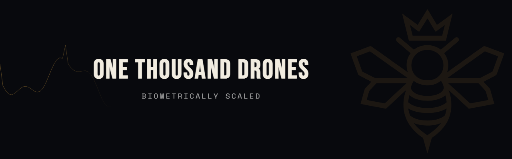
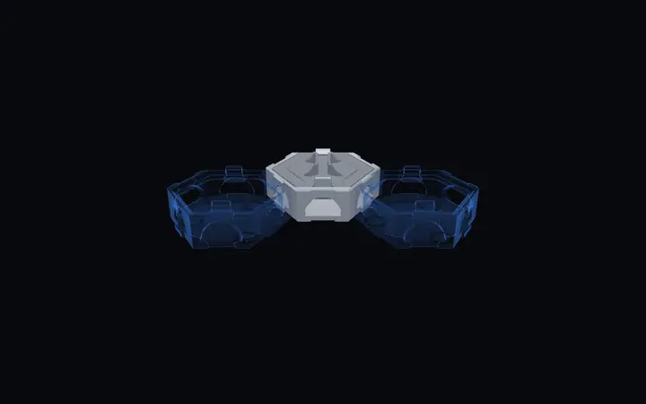

# One Thousand Drones

**One mind, many machines.**

One Thousand Drones builds brain-to-swarm systems: biometrically scaled neuro-robotic shared control that reads an operator's brain and body signals and scales one person's intent across many autonomous machines. Broken Arrow, Oklahoma.

Our open education arm, the Academy, teaches the hardware and brain-computer-interface fundamentals behind that work, one build at a time. It is free and hands-on.

### Hex Cluster

<picture>
  <source media="(prefers-color-scheme: dark)" srcset="assets/hex-cluster-loop.webp">
  <source media="(prefers-color-scheme: light)" srcset="assets/hex-cluster-loop-ivory.webp">
  
</picture>

Printable carrier tiles that dovetail on all six edges, so a tiled layout behaves as one rigid body. The boards we test sit in them. The geometry is a free download.

- **Files and print spec** · [academy.onethousanddrones.com/hex](https://academy.onethousanddrones.com/hex) · CC BY 4.0, one zip, no account
- **Configurator** · [demo.onethousanddrones.com/hex](https://demo.onethousanddrones.com/hex) · lay out a cluster in the browser and export only the parts it needs

### Explore

- **Company** · [onethousanddrones.com](https://onethousanddrones.com)
- **Academy** · [academy.onethousanddrones.com](https://academy.onethousanddrones.com) · open hardware and BCI curriculum, build it for real
- **Brand and media kit** · [onethousanddrones.com/brand](https://onethousanddrones.com/brand)

### Follow

- X · [@1KDrones](https://x.com/1KDrones)
- YouTube · [@1kDrones](https://www.youtube.com/@1kDrones)
- LinkedIn · [One Thousand Drones](https://www.linkedin.com/company/one-thousand-drones)

### Registry

Broken Arrow, OK · USA · SAM.gov registered · CAGE 1ZYS4 · UEI WDQXD9L9UFH3
