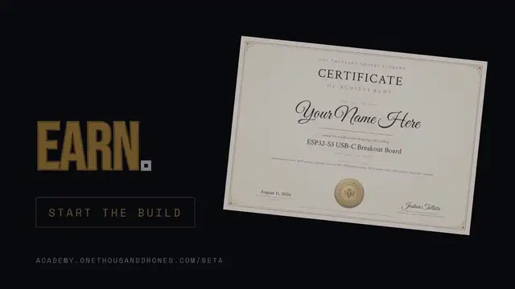

# One Thousand Drones

**One mind, many machines.**

One Thousand Drones builds brain-to-swarm systems: biometrically scaled neuro-robotic shared control that reads an operator's brain and body signals and scales one person's intent across many autonomous machines. Broken Arrow, Oklahoma.

Our open education arm, the Academy, teaches the hardware and brain-computer-interface fundamentals behind that work, one build at a time. It is free and hands-on.

### Hex Cluster

<!-- TODO(8.1 art): the v2 still or loop belongs here. Confirm assets/hex-cluster-loop.webp shows v2 geometry, or replace it; then check the alt text against the final frames. -->

<!-- OWNER-REVIEW: the paragraph and the two link lines below are the v2 draft, reusing the academy /hex draft's wording. The configurator link, hex.onethousanddrones.com, is decision 1.10 and must be live before this is pushed (10.6). -->
A bench mounting standard you print yourself. Every base carries a dovetail on all six edges, so a layout of any size locks together and moves as one piece. The geometry is a free download.

- **Files and print spec** · [academy.onethousanddrones.com/hex](https://academy.onethousanddrones.com/hex) · CC BY 4.0, one zip, no account
- **Configurator** · [hex.onethousanddrones.com](https://hex.onethousanddrones.com) · plan a layout in the browser and download only the parts it needs

### Academy

Twenty-two projects from your first ESP32 board to an EEG BCI that commands your own swarm. You draw the schematic, lay out the board, and run the checks. L1.01 is free.

- **Start here** · [academy.onethousanddrones.com/beta](https://academy.onethousanddrones.com/beta) · eight gated cards, a final exam, and a board you drew
- **Reference library** · [academy.onethousanddrones.com/library](https://academy.onethousanddrones.com/library) · 69 lessons, free, no account

### Explore

- **Company** · [onethousanddrones.com](https://onethousanddrones.com)
- **Academy** · [academy.onethousanddrones.com](https://academy.onethousanddrones.com) · open hardware and BCI curriculum, build it for real
- **Brand and media kit** · [onethousanddrones.com/brand](https://onethousanddrones.com/brand)

### Follow

- X · [@1KDrones](https://x.com/1KDrones)
- YouTube · [@1kDrones](https://www.youtube.com/@1kDrones)
- LinkedIn · [One Thousand Drones](https://www.linkedin.com/company/one-thousand-drones)

### Registry

Broken Arrow, OK · USA · SAM.gov registered · CAGE 1ZYS4 · UEI WDQXD9L9UFH3
